# VietnamGuide Evergreen Content Roadmap

**Goal:** Build a durable English-first evergreen content system for VietnamGuide that wins on route decisions, practical planning, and trust.

**Architecture:** The site should be organized as a small number of strong hubs that feed deeper decision pages. Every page must resolve one user decision, show evidence, cite sources, and point to the next best page in the journey. Content should age slowly, update cleanly, and avoid rewritten-search-result filler.

**Operating model:** Evidence-led Concierge. One page, one decision. Real images where proof matters. Live facts only where facts move. Source trail and update log on every deep page.

---

## 1. Evergreen Content Rules

- Write for English-searching international travelers first.
- Build pages around decisions, not keywords.
- If a page cannot help a reader choose, cut it.
- Every deep guide should include:
  - verdict
  - proof panel or proof images
  - source trail
  - update log
  - related routes
- Use real photography for destination and route proof.
- Use AI image generation only for editorial diagrams or clearly labeled supporting visuals, never for fake destination evidence.
- Keep live data separate from evergreen advice.
- Avoid generic listicles, thin FAQs, and keyword padding.
- Treat updated dates as editorial accountability, not decoration.

## 2. Current Evergreen Spine

These pages already form the core decision spine and should be treated as the canonical internal-link backbone:

- Home
- Vietnam Travel Guide
- Best Time to Visit Vietnam
- Vietnam E-Visa
- Vietnam Travel Cost
- North vs Central vs South Vietnam
- 10 Days in Vietnam
- 14 Days in Vietnam
- Best Places to Visit in Vietnam

These are not just pages. They are the route spine for the entire site.

## 3. Evergreen Content Pillars

### Pillar A: Planning Order

Purpose: help readers decide what to do first.

Pages:
- Vietnam Travel Guide
- Best Time to Visit Vietnam
- Vietnam E-Visa
- Vietnam Travel Cost
- Transport Within Vietnam
- Money, Cash, Cards, and ATMs
- SIM/eSIM in Vietnam
- Safety and Scams
- Health and Insurance

### Pillar B: Route Length and Pace

Purpose: help readers choose a realistic trip shape.

Pages:
- 7 Days in Vietnam
- 10 Days in Vietnam
- 14 Days in Vietnam
- 21 Days in Vietnam
- Slow Travel in Vietnam
- Family Vietnam Itinerary
- Premium Vietnam Itinerary
- Solo Vietnam Itinerary

### Pillar C: Region and Destination Choice

Purpose: help readers choose where to focus.

Pages:
- North vs Central vs South Vietnam
- Best Places to Visit in Vietnam
- Hanoi Travel Guide
- Hoi An Travel Guide
- Hue Travel Guide
- Ninh Binh Travel Guide
- Ha Long Bay Guide
- Da Nang Travel Guide
- Ho Chi Minh City Travel Guide
- Mekong Delta Guide
- Phu Quoc Guide

### Pillar D: Comparison and Trade-Off Pages

Purpose: help readers choose between close alternatives.

Pages:
- Ha Long Bay vs Lan Ha Bay
- Hanoi vs Ho Chi Minh City
- Hoi An vs Hue
- Da Nang vs Hoi An
- Sapa vs Ha Giang
- Phu Quoc vs Nha Trang
- North Vietnam vs Central Vietnam for a First Trip

### Pillar E: Monetization-Safe Support Pages

Purpose: support conversions without making the site feel commercial.

Pages:
- Best eSIM for Vietnam
- Best Travel Insurance for Vietnam
- Best Bay Cruises
- Best Areas to Stay in Hanoi
- Best Areas to Stay in Hoi An
- Best Areas to Stay in Ho Chi Minh City

Only build these after the core planning spine is strong.

## 4. Content Template Rules by Page Type

### Hubs

- Short orientation copy.
- Strong route paths.
- Clear links to decision pages.
- No long scroll of repeated teasers.

### Pillar Guides

- One main verdict.
- One proof panel.
- One route matrix.
- One source trail.
- One update log.
- Related routes at the end.

### Comparison Pages

- Direct choice in the first screen.
- Comparison matrix.
- Skip logic.
- Traveler-fit rows.
- Internal links to next-step pages.

### Destination Pages

- Best for / not ideal for.
- Best time.
- How many days.
- Where to stay.
- Getting there.
- Related itinerary pairings.
- Source/update discipline.

### Practical Pages

- Short answer first.
- Step-by-step where needed.
- Official sources.
- Live-check list.
- Minimal fluff.

## 5. 12-Month Editorial Calendar

This calendar starts from July 2026 and is deliberately evergreen. The dates are operating windows, not strict launch deadlines.

| Month | Focus | Core pages | Support pages | Outcome |
| --- | --- | --- | --- | --- |
| Jul 2026 | Stabilize the planning spine | Best Time, North vs Central vs South, Vietnam Travel Guide | Source/update policy refresh | Make the route decision layer unmistakable |
| Aug 2026 | Practical logistics | Transport Within Vietnam, Money/Cash/Cards, SIM/eSIM | Airport arrival guides | Reduce friction before booking |
| Sep 2026 | Trust and risk pages | Safety and Scams, Health and Insurance | Travel insurance comparisons | Make the site feel useful and calm |
| Oct 2026 | Hanoi-led depth | Hanoi Travel Guide, Hanoi vs Ho Chi Minh City | Best areas to stay in Hanoi | Capture first-trip city intent |
| Nov 2026 | Central Vietnam depth | Hoi An, Hue, Da Nang | Hoi An vs Hue, Da Nang vs Hoi An | Strengthen the calmer route cluster |
| Dec 2026 | Island and beach intent | Phu Quoc, Best Beaches in Vietnam | Phu Quoc vs Nha Trang | Cover warm-weather and winter-sun searches |
| Jan 2027 | Route-length expansion | 7 Days, 21 Days, Slow Travel | 7 vs 10 vs 14 vs 21 day comparisons | Fill the itinerary ladder |
| Feb 2027 | Northern landscape cluster | Ninh Binh, Ha Long Bay, Lan Ha Bay | Ha Long vs Lan Ha, Sapa vs Ha Giang | Deepen scenery and photography intent |
| Mar 2027 | Southern chapter depth | Ho Chi Minh City, Mekong Delta | Best areas to stay in Ho Chi Minh City | Convert southern city and river intent |
| Apr 2027 | Families and premium | Family Vietnam Itinerary, Premium Vietnam Itinerary | Best areas to stay in premium hubs | Target higher-value travel intents |
| May 2027 | Destination shortlist refresh | Best Places to Visit in Vietnam | Region-vs-destination support pages | Tighten shortlist pages and skip logic |
| Jun 2027 | Refresh and prune | Update the top 15 pages | Rework weak internal links | Keep the evergreen spine current |

## 6. Prioritized Backlog

### Tier 1: Next 90 Days

1. Transport Within Vietnam
2. Money, Cash, Cards, and ATMs
3. SIM/eSIM in Vietnam
4. Safety and Scams
5. Health and Insurance
6. Hanoi Travel Guide
7. Hoi An Travel Guide
8. Hue Travel Guide
9. Ninh Binh Travel Guide
10. Ha Long Bay or Lan Ha Bay comparison

### Tier 2: Next 3-6 Months

1. Da Nang Travel Guide
2. Ho Chi Minh City Travel Guide
3. Mekong Delta Guide
4. Phu Quoc Guide
5. Hoi An vs Hue
6. Da Nang vs Hoi An
7. Hanoi vs Ho Chi Minh City
8. Sapa vs Ha Giang
9. Best beaches in Vietnam
10. Best islands in Vietnam

### Tier 3: Next 6-12 Months

1. 7 Days in Vietnam
2. 21 Days in Vietnam
3. Slow Travel in Vietnam
4. Family Vietnam Itinerary
5. Premium Vietnam Itinerary
6. Solo Vietnam Itinerary
7. Best areas to stay in Hanoi
8. Best areas to stay in Hoi An
9. Best areas to stay in Ho Chi Minh City
10. Best travel insurance for Vietnam

## 7. Internal-Link Spine

```mermaid
flowchart TD
    Home --> PlanHub["Plan hub"]
    Home --> DestHub["Destinations hub"]
    Home --> ItinHub["Itineraries hub"]
    Home --> CompareHub["Compare hub"]
    Home --> CostHub["Costs hub"]

    PlanHub --> TravelGuide["Vietnam Travel Guide"]
    PlanHub --> BestTime["Best Time to Visit Vietnam"]
    PlanHub --> Evisa["Vietnam E-Visa"]
    PlanHub --> Transport["Transport Within Vietnam"]
    PlanHub --> Money["Money / Cash / Cards"]
    PlanHub --> Safety["Safety / Scams / Health"]

    ItinHub --> Seven["7 Days"]
    ItinHub --> Ten["10 Days"]
    ItinHub --> Fourteen["14 Days"]
    ItinHub --> TwentyOne["21 Days"]

    CompareHub --> RegionCompare["North vs Central vs South"]
    CompareHub --> HLB["Ha Long vs Lan Ha"]
    CompareHub --> HoiAnHue["Hoi An vs Hue"]
    CompareHub --> DNH["Da Nang vs Hoi An"]

    DestHub --> Hanoi["Hanoi"]
    DestHub --> HoiAn["Hoi An"]
    DestHub --> Hue["Hue"]
    DestHub --> NinhBinh["Ninh Binh"]
    DestHub --> HCMC["Ho Chi Minh City"]
    DestHub --> Mekong["Mekong Delta"]
    DestHub --> PhuQuoc["Phu Quoc"]

    CostHub --> CostGuide["Vietnam Travel Cost"]
    CostHub --> Insurance["Travel insurance"]
    CostHub --> ESim["SIM/eSIM"]
```

### Link Rules

- Every new page should link up to its hub.
- Every new page should link sideways to at least two adjacent decision pages.
- Every deep page should point to the next decision, not only to related content.
- Every route page should link back to Best Time, Cost, and Region Comparison.
- Every destination page should link to the relevant itinerary page and the relevant comparison page.
- No orphan pages.

## 8. Refresh Cadence

### Monthly

- Best Time to Visit Vietnam
- Vietnam Travel Cost
- E-Visa if rules change
- Homepage source/update snapshot

### Quarterly

- Vietnam Travel Guide
- North vs Central vs South Vietnam
- 10 Days in Vietnam
- 14 Days in Vietnam
- Transport Within Vietnam

### Semiannual

- Destination pages
- Comparison pages
- Family/premium/solo itinerary variants

### Trigger-Based

Refresh immediately when:

- visa rules change
- weather guidance changes
- transport policies change
- a cruise/route policy changes
- a source URL moves
- a page starts ranking but underperforms on intent

## 9. Quality Gates

No page ships unless it has:

- a clear verdict
- a visible source trail
- an update log
- at least one internal link upward to the hub
- at least two relevant lateral links
- a reason to exist beyond rewriting search results

For deep guides, also require:

- proof images or proof panel
- skip logic
- before-booking checks
- related routes

## 10. Content Style Guardrails

- No keyword stuffing.
- No generic listicles.
- No false certainty about weather or live logistics.
- No decorative images without a planning purpose.
- No AI-generated fake travel proof.
- No page should try to answer five unrelated intents.
- If a page becomes too broad, split it.

## 11. Measurement

Track:

- organic clicks from English queries
- internal click-through from hub pages to deep pages
- number of pages with full source/update compliance
- number of pages with clear verdicts and route guidance
- refresh frequency on volatile pages
- ranking movement on comparison and itinerary pages

## 12. First Execution Wave

If the team resumes content production now, the next best sequence is:

1. Transport Within Vietnam
2. Money, Cash, Cards, and ATMs
3. SIM/eSIM in Vietnam
4. Safety and Scams
5. Health and Insurance
6. Hanoi Travel Guide
7. Hoi An Travel Guide
8. Hue Travel Guide
9. Ninh Binh Travel Guide
10. Ha Long Bay vs Lan Ha Bay

That order protects both usefulness and internal-link strength.

## 13. Non-Negotiables

- English-first.
- Evergreen first.
- Decision-first.
- Evidence-first.
- Image-proofed where it matters.
- Updated when reality changes.
- Never spammy.

